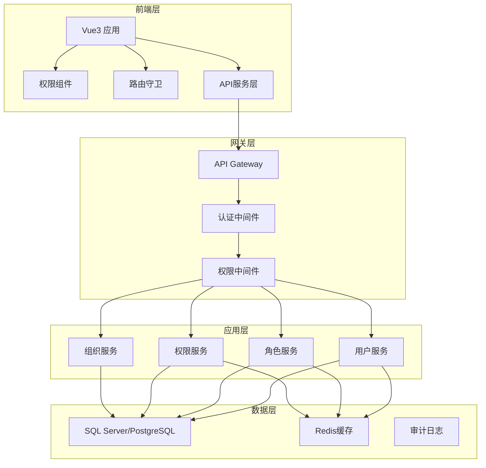

# RBAC 组件级权限管理系统开发文档

## 1. 项目概述

### 1.1 项目目标
开发一个基于角色的访问控制（RBAC）的组件级权限管理系统，实现精细化的权限控制，支持动态权限分配和管理。

### 1.2 核心特性
- **组件级权限控制**：精确到每个UI组件的权限管理
- **角色管理**：支持多角色、角色继承和动态角色分配
- **权限管理**：支持权限的增删改查和动态配置
- **用户管理**：完整的用户生命周期管理
- **审计日志**：完整的操作记录和审计追踪
- **多租户支持**：支持多组织架构

### 1.3 技术选型

#### 前端技术栈
- **框架**: Vue 3.x + TypeScript
- **管理系统模板**: vue-next-admin
- **状态管理**: Pinia
- **路由**: Vue Router 4.x
- **UI组件库**: Element Plus
- **HTTP客户端**: Axios
- **构建工具**: Vite
- **代码规范**: ESLint + Prettier

#### 后端技术栈
- **框架**: .NET 8.0 + ASP.NET Core
- **数据库**: SQLite
- **ORM**: SqlSugar
- **认证授权**: JWT + ASP.NET Core Identity
- **API文档**: Swagger/OpenAPI
- **缓存**: MemoryCache
- **日志**: Serilog
- **部署**: IIS

## 2. 系统架构设计

### 2.1 整体架构



### 2.2 模块划分

#### 2.2.1 前端模块
```
frontend/
├── src/
│   ├── components/           # 公共组件
│   │   ├── Permission/       # 权限控制组件
│   │   ├── RoleSelector/     # 角色选择器
│   │   └── UserManagement/   # 用户管理组件
│   ├── composables/         # 组合式函数
│   │   ├── usePermission.ts # 权限检查逻辑
│   │   ├── useRole.ts       # 角色管理逻辑
│   │   └── useAuth.ts       # 认证逻辑
│   ├── stores/              # 状态管理
│   │   ├── auth.ts          # 认证状态
│   │   ├── permission.ts    # 权限状态
│   │   └── user.ts          # 用户状态
│   ├── services/            # API服务
│   │   ├── auth.service.ts
│   │   ├── user.service.ts
│   │   ├── role.service.ts
│   │   └── permission.service.ts
│   ├── types/               # TypeScript类型定义
│   ├── router/              # 路由配置
│   ├── directives/          # 自定义指令
│   └── utils/               # 工具函数
```

#### 2.2.2 后端模块
```
backend/
├── RBAC.Core/                # 核心域模型
│   ├── Entities/             # 实体类
│   ├── Interfaces/           # 接口定义
│   ├── ValueObjects/         # 值对象
│   └── Services/             # 域服务
├── RBAC.Infrastructure/       # 基础设施层
│   ├── Data/                 # 数据访问
│   ├── Repositories/         # 仓储实现
│   ├── Services/             # 外部服务
│   └── Configurations/       # 配置
├── RBAC.Application/          # 应用服务层
│   ├── Services/             # 应用服务
│   ├── DTOs/                 # 数据传输对象
│   ├── Mappers/              # 对象映射
│   └── Validators/           # 验证器
├── RBAC.WebAPI/              # Web API层
│   ├── Controllers/          # 控制器
│   ├── Middlewares/          # 中间件
│   ├── Filters/              # 过滤器
│   └── Extensions/           # 扩展方法
└── RBAC.Tests/               # 测试项目
```
